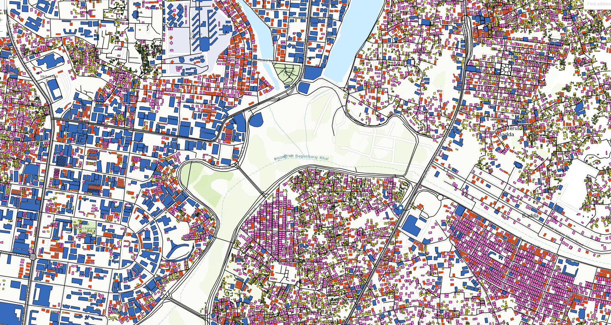
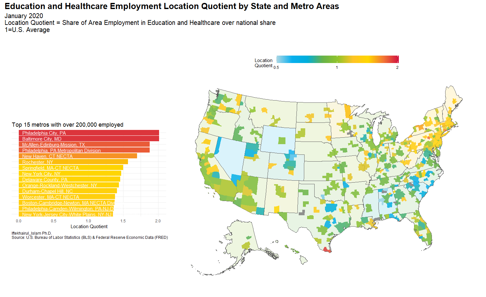
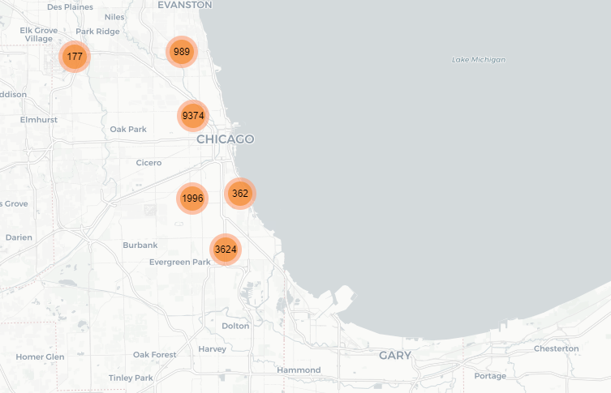
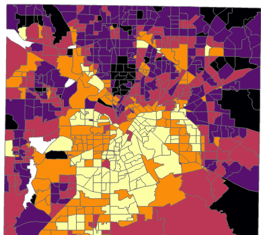
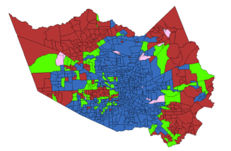
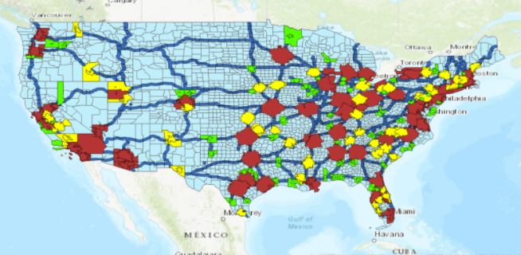

# Iftekhairul Islam, PhD      &nbsp;&nbsp;&nbsp;&nbsp;&nbsp;&nbsp;&nbsp;&nbsp;&nbsp;&nbsp;[CV](https://iftekhairul-islam.github.io/CV/)
**Political Economist, Data Scientist, Spatial and RS Data Analyst, Data Story Teller**
## [Dhaka City Digital Map- First of it's Kind!!!](http://analytixbd.com/)
This is the very first digital visualization of Dhaka, the capital of Bangladesh. It would not only help the government organizations like city corporation for assessing and collecting tax, fire department for emergency evacuation and disaster management, police department to pinpoint high crime areas, RAJUK for illegal development control, BBS for the census but also this digital technology would assist private sectors with real-time market survey, real estate valuation and rental price, finding suitable locations for social amenities and business setups or comparing living conditions of different areas.

## [Impact of AI and ML algorithms on Employment: A State-level Analysis](https://arxiv.org/abs/2001.02783)
In this analysis I have used unsupervised learning approach (K-medoid Clustering) to detect how the prospect of some mid-level jobs have been declining for the last several years, and what would be the state-level exposure in terms of unemployment.

## [Application of Remotely Sensed (RS) data to monitor SDG](https://www.thedailystar.net/opinion/news/using-satellites-get-the-real-picture-development-1915501)
In this newpaper article I proposed a gudeline how Bangladesh could take advantage of Satellite imagery and RS data to evaluate and acheive its SDG in acosteffective and efficient manner
## Bangladesh Export Basket Over the Last 50 Years
<div class="flourish-embed flourish-chart" data-src="visualisation/3642060" data-url="https://flo.uri.sh/visualisation/3642060/embed" aria-label=""><script src="https://public.flourish.studio/resources/embed.js"></script></div>
Please, press the ***'Ranks'*** button on the upper left corner
## [Chicago Crime (Theft) Hotspots in 2018](https://rpubs.com/ifteresearch/ChicagoCrime)
In this visualization, I have used R to map Crime hotspots, i.e., where most of the thefts took place in Chicago in 2018.

## [A tale of two counties - How the voting preferences are different in Dallas and Harris counties?](https://www.linkedin.com/pulse/tale-two-counties-iftekhairul-islam/?trackingId=%2FUSDHASSQHWHsh%2FUrrMMkA%3D%3D)
Here, I have used areal interpolation (Kriging) to get precinct level demographics, income, racial data from the census block groups and run RandomForest algorithm to detect the most important attributes that influence voting choice in 2016 Presidential election in Dallas and Harris counties.

## [Rohingya Camp: A Timelapse Satellite Imge Compilation](https://github.com/Iftekhairul-Islam/Rohingya/)
Here, I have shown how the Rohingya camp site was chnaged in just two years in between 2016 to 2018.
## [Data Stories- Decades of Changes Visualized in Minutes!!!](https://medium.com/@iftekharshajib/data-stories-1f08804153eb)
Here, I have tried to show interactively how different social, political, and economic dynamics changed course over time. I have used cutting edge data visualization techniques to make sense of variables.
## [Dhaka: An Urban Journey Towards Doom](https://medium.com/@iftekharshajib/dhaka-an-urban-journey-towards-doom-4655679192fb)
In this satellite-image analysis, I detect how the urbanization trajectory of Dhaka, the capital of Bangladesh, took a nose-dive in the last 20 years.
## Twitter Data Analysis (upcoming)
This is a demonstration of scraping Twitter data, and how to do networks and sentiment analysis 

## [2016 Election Result Analysis](https://www.arcgis.com/home/webmap/viewer.html?url=https://services2.arcgis.com/VNo0ht0YPXJoI4oE/ArcGIS/rest/services/Map1/FeatureServer&source=sd)
This is a precinct-level election result anlysis focusing on racial and demographics impact on voting choice
## [Racial Context of Covid-19](https://www.linkedin.com/pulse/impact-covid-19-employment-racially-biased-iftekhairul-islam/?trackingId=4zE5vA37QdOIYy6VnNhRuw%3D%3D)
This analysis shows how Covid-19 situation put the minority workers more in vulnerable position
## The Curse of Inaccessibility (upcoming)
This analysis finds a negative relationship between productivity of workers and the distance of their residence from the nearest MSA and highway 
## [The Blessings of Inaccessibility](https://www.linkedin.com/pulse/blessings-inaccessibility-iftekhairul-islam/)
In this study I found how the small cities and MSAs are convenienly safe from the impact of Covid-19, both in terms of number of cases and economic perpective.

## [A NightTimeLight Satellite Image Analysis](https://iftekhairul-islam.github.io/NightTimeLight/)
Here, I have analyesd NASA VIIRS NightTimeLIght satellite images and showed how the economic development in Bangladesh has been non-honmogeneous around the country

## [Relief-optimization during Covid-19 Pandemic in Bangladesh](https://iftekhairul-islam.github.io/Relief_Optimization/)
Here, I would like to propose a rough guideline on how to mobiize food grains in different parts of Bangladesh taking into consideartion the existing poverty level, current and upcoming yeilds, and the density of population.

```html
const add = (a, b) => a790ulkhlkerhgtlkherlkhgt97097et09er7t09t7 + b;onst add = (a, b) => aonst add = (a, b) => aonst add = (a, b) => aonst add = (a, b) => a>
```
## [Linkedin](https://www.linkedin.com/in/iftekhairul-islam-20695332/)

